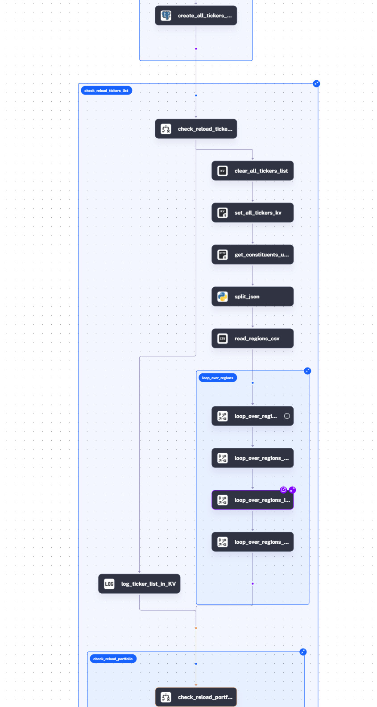
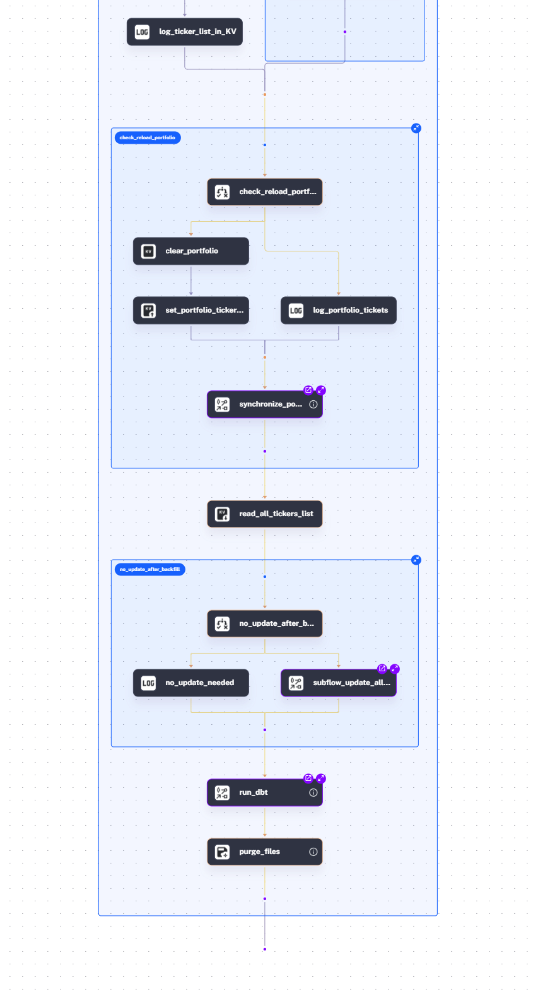
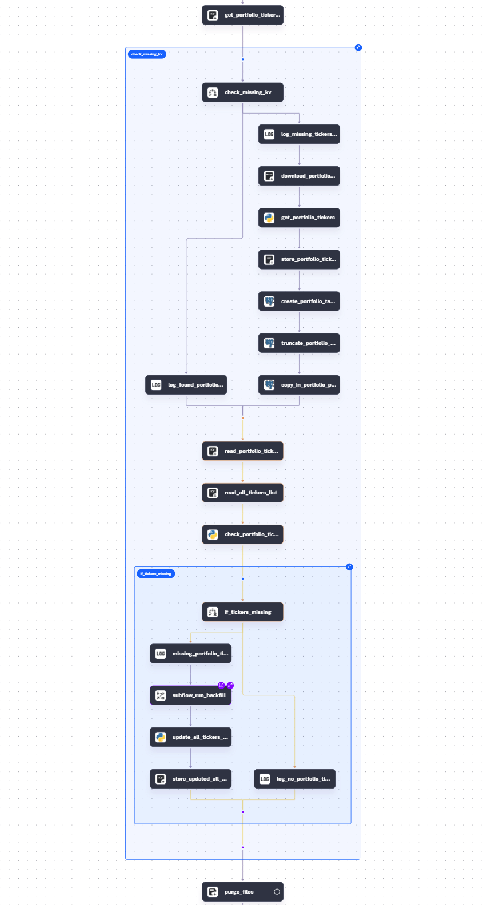

# Custom Portfolio Performance Tracking

> [!NOTE]
> DataTalksClub data-engineering-zoomcamp capstone project.

## 1. Introduction
### 1.1 Problem Description

Retail investors, in particular, informed traders, usually look up a lot of information on the Internet.
This information typically includes financial and economic news, published reports, and a number of indicators.
Gathering the required information might be time consuming and costly, and might not always be available at hand.
Furthermore, it is important to assess the quality of the investment decisions one makes and how they affect the portfolio (and investor's wealth).
Standard brokers (for example, Trade Republic) offer limited scope for analysis of a custom portfolio.[^1]
Financial portals like Yahoo! Finance, offer analysis tools and performance tracking for users with paid subscription.[^2]

This project provides a data pipeline that creates a fully-functioning data system that can already be used to analyze portfolio performance, and to be used later as a local data source for training ML models.
The final dashboard provides a simple overview of the custom portfolio, its risk-return profile (and the comparison to risk-return profiles of other assets in the market including portfolio's individual components), and displays portfolio's performance over time.
Various types of analysis can be built on top of this foundation.

> [!NOTE]
> P.S. I am also going to use this data pipeline in the future to train ML models that will help developing trading strategies and optimizing portfolio selection, although these steps are momentarily beyond the scope of the project.

### 1.2 Final Dashboard

Here is the [link](https://lookerstudio.google.com/s/vaDl_y1V2eA) to the Dashboard in Looker Studio.

---
> [!NOTE]
> This dashboard will be active till 2025-04-26, and will be terminated afterwards. Please see the screenshot below or use `local/kestra` branch with a Grafana dashboarad.

---

[^1]: Trade Republic shows the statistics and the dynamics for returns/gains of the performance portfolio you currently have, not for the portfolio you want to check/compare.

[^2]: Risk Analysis and Portfolio Performance are, for example, available at [Yahoo! Finace website](https://finance.yahoo.com/about/plans/select-plan/portfolioAnalytics) only for users with a paid subscription (starting from $7.95/month for a Bronze tier).

## 2. Project Description
### 2.1 Branches

* **`main`** (*current*) -- for GCP/GCS/BigQuery with orchestration in Kestra.
* `local/kestra` -- for local Postgres with orchestration in Kestra.

### 2.2 Features & Tools

For the GCP setup, the following tools have been used

1. Could storage infrastructure is implemented using Infrastructure-as-Code (IaC) with [Terraform](https://www.terraform.io/).
2. Workflow orchestration with batch processing is implemented in [Kestra](https://kestra.io/).
3. Data is loaded via [Python](https://www.python.org/) scripts using popular libraries such as: `requests`, `beautifulsoup`, `pandas`. Financial data is retreived using `yfinance` library API.
4. Data is stored in a [GCS](https://cloud.google.com/storage) bucket and loaded to [BigQuery](https://cloud.google.com/bigquery).
5. Analytical transformations are managed with [dbt Labs](https://www.getdbt.com/).
6. Dashboard in [Looker](https://cloud.google.com/looker-bi).
7. Easy installation with a bash script.
8. Available for development in a cloud and locally: two branches for different setups.

### 2.3 Installation Guide

For installation on GCP you need:

- a GCP project,
- a VM instance created in that project that you can access with SSH,
- a service account with admin roles for Storage and BigQuery[^admin], and
- a credentials `.json` file for that service account.

Please, read the complete [installation guide here](./installation.md).

[^admin]: Storage Admin and BigQuery Admin might have too broad permissions than what you need for this project. However, we used such permissions during the course. I recommend using the same roles when running a replication of this project but considering restricting those when using in production environments.

### 2.4 Data Lineage

1.  Two input files (stored in the GitHub repository for this project):

    1. [`index_constituents_links.json`](./src/inputs/index_constituents_links.json) with links to Wikipedia pages that contain lists of stocks constituting the major indices of the selected regions/countries (like [this page for S\&P 500](http://en.wikipedia.org/wiki/List_of_S%26P_500_companies)).
    2.  [`portfolio.json`](./src/inputs/portfolio.json) with an array of the following JSON enries::

        1. `ticker` are tickers that can be found in [Yahoo! Finance search](https://finance.yahoo.com/).
        2. `type`: `buy` or `sell`,
        3. `timestamp`: when transaction happened,
        4. `volume`: number of shares,
        5. `volume_type`: currently only supports `shares` (not monetary amount).

2. Stock information (company name and suggested ticker) is extracted from the links to Wikipedia pages.
3. Corrected ticker information (ticker symbol, sector, industry, exchange) is searched through `yfinance` API.
4.  Tickers' price (as well as volumes, dividends, and stock splits) histories for the stocks from the indices and from the portfolio are loaded on a daily basis to GCS and stored in Bigquery.

    1.  `whole_history` option allows backfilling the whole history of prices at once.
    2.  The main table with all tickers' price histories, `all_tickers_prices`, is partitioned by month (with 761 partitions as of April 2025) and clustered by ticker. The reason for that is to limit the amount of the scanned data when constructing the portfolio indicators:

        1. For the portfolio analysis, we are primarily interested in the performance of the tickers over a certain period. Limiting the period we need to scan in `all_tickers_prices` makes the query less costly.
        2. Portfolios constitute of tickers. In the analysis, we are only interested in histories of those tickers that ever been part of our portfolio. Therefore, clustering on the ticker level further reduces the volume that needs to be scanned in order to get the required histories.

5.  Data is transformed using `dbt` and loaded back to BigQuery.

    1. Includes the calculation of the risk-return profile for the whole portfolio, its individual components, and other tickers.
    2. Implemented tests to ensure high data quality.
    3. Documented tables and columns help clearly understand and better navigate (however, hosting Documentation is not implemented).

6. Risk-return profile and portfolio's composition and performance are visualized in a Looker dashboard.

See Kestra flows topology here

Main flow:

Regional sub-flow:

Portfolio update sub-flow:

See dbt DAGs here

(this graph was made with `dbt docs generate` using [local implementation](https://github.com/mananyev/portfolio-performance-tracking/tree/local/kestra))

## 3. Challenges

The project solves a number of technical challenges:

1.  The absence of the comprehensive list of all traded stock tickers

    1. It is difficult, if not impossible, to find the stocks traded in a certain market, to be able to perform analysis and provide market insights.
    2.  In this project, I use a subsample of traded stocks from a particular set of markets that constitute major stock indices for those markets (one index per market). The markets (and indices) are:

        1. US: S&P 500
        2. China: CSI 300
        3. Germany: DAX
        4. India: NIFTY 50
        5. UK: FTSE 100
        6. Europe: Euro STOXX 50
        7. Latin America: S&P Latin America 40

    3. The list of stocks constituting those indices is expanded with the stocks from the custom portfolio, if they were originally missing.

2.  Ticker symbols found on the Internet do not always match the financial data available via API.

    1. For example, `4imprint Group plc`, traded as `FOUR` at LSE [has ticker symbol `FOUR.L` on the Yahoo! Finace website](https://finance.yahoo.com/quote/FOUR.L/), while ticker symbol `FOUR` on the same web-portal [corresponds](https://finance.yahoo.com/quote/FOUR/) to `Shift4 Payments, Inc`..
    2. In this project I employ search and matching by ticker symbol and company name to extract the right data from the API.

3.  Batch processing has to be implemented differently, depending on whether the backfill or a regular update is needed:

    1. The data on stock prices for the constituents of the seven selected indices exceeds 7 million rows (full history of prices for more than a thousand ticker symbols).
    2.  Some stocks originate from the 60s: that's more than 20 thousand daily batches. Even restricting the data to start from 2010 would result in approximately 5 thousand daily batches.

        1. In order to be able to use this data to train ML models, I prefer having full history of prices.
        2. In order to get historical prices and volumes of those stocks, I use region-level batches, leveraging Kestra loops and subflows, as well as KV Store and internal storage.
        3. Regular updates are done with daily batches.

## 4. Limitations
### 4.1 Stocks Selection and Portfolio Data

Current pipeline implementation is limited to the stocks constituting major indices of the selected countries/regions.
Portfolio file is only stored in GitHub repo and can only be changed after some code tweaking (or replacing the file in the repo).

### 4.2 Portfolio Limitations

Current implementation for portfolio performance only allows for buy and sell positions and only for volume given in shares (not in monetary terms).
Technically, short positions are allowed with the "sell" position type.

### 4.3 `yfinance` Rate Limitation

This project uses `yfinance` API, an unofficial API scraping data from the Yahoo! Finance page.
The request rate is known to be limited.
The code uses high rate of requests when getting the stock data (ticker symbol, sector, industry, etc.) for a given index: the higher the number of stocks in the index, the higher the chances that you might hit the rate limit.

In order to avoid hitting rate limitation when getting more stocks data (e.g. by adding more indices and their constituents links), consider adding smaller indices into the JSON file with links to index constituents.

Problems I've encountered so far:

- having regions/index constituents with too many ticker symbol entries may result in `yfinance` giving an error, especially when running multiple regions at a time.
- occasionally ran into `OperationalError('database is locked')` when updating portfolio - resulting in some portfolio tickers missing (solved with a complete re-run from the scratch).

### 4.4 Regional Market Analysis

Some markets may have overlapping assets constituning the major index. For example, some DAX constituents can be found in STOXX 50 Europe (Adidas, `ADS.DE` and others). Although the list for regional constituents is available in the external tables, it requires extra effort to generate corresponding retional market breakdowns (with returns and corresponding statistics of interest).

### 4.5 Analysis Limitation

Currently, the analysis is limited to the calculation of returns, net gains, and risk-return profiles.

### 4.6 Resource Requirements Limitation

I tried running this project locally on a standard `e2-medium` VM (2 vCPU, 1 core, 4 GB memory) with a 10 GB drive, and the initial backfill execution (most important one) failed due to memory issues.

Running the same local setup on a `e2-standard-4` VM (4 vCPUs, 16 GB Memory) with extra disk space (20 GB total) went with no issues.

## 5. Future Steps

The main purpose for this data pipeline is to create a well-rounded clean database with financial data on daily trading prices and volumes. The data will later be used for training ML models to optimize portfolio selection.
Although the main goal is achieved with the current implementation, I believe it can be further greatly improved.
Major improvement steps, as I envision them, include:

1.  An easy way to load a custom portfolio

    1. assuming an ML model producing an output with tickers (components), their transaction date, and traded volume (similar to the [example portfolio](./src/inputs/portfolio.json)), this pipeline needs to read the file from a local/cloud storage.

2.  A benchmark functionality:

    1. Country/region indices, custom portfolios, or backtesting portfolios suggested by an ML model.
    2. Regional markets performance.
 
3. GitHub Actions for CI/CD.

## 6. Acknowledgements

I would like to express my sincere gratitute to [DataTalksClub](https://github.com/DataTalksClub/), and [Alexey Grigoriev](https://www.linkedin.com/in/agrigorev) in particular, for the opportunity to learn and put the skills to practice with the Data Engineering Zoomcamp (check their [repo](https://github.com/DataTalksClub/data-engineering-zoomcamp) for the fantastic set of learning materials!).
Special thanks to all the coaches and lecturers who supported this course.
Finally, big thanks to the community for the engagement and the support.
